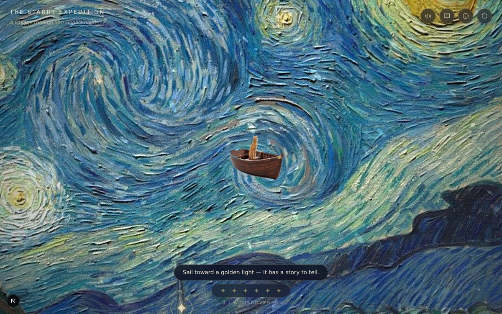
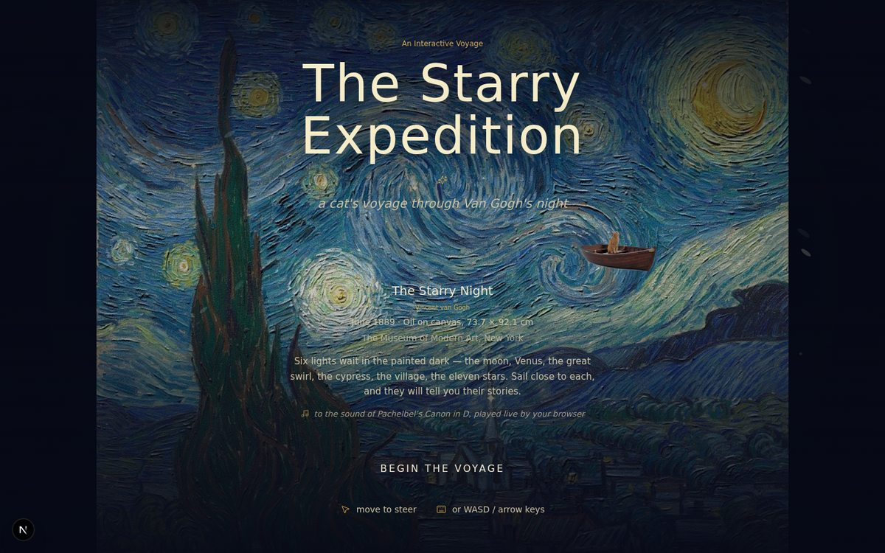
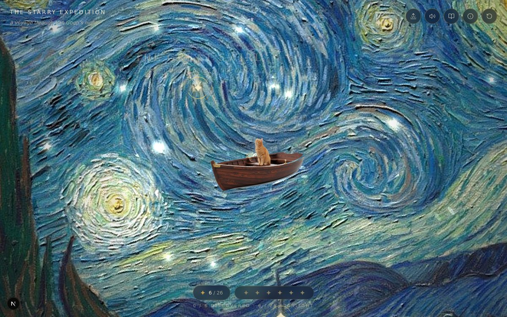
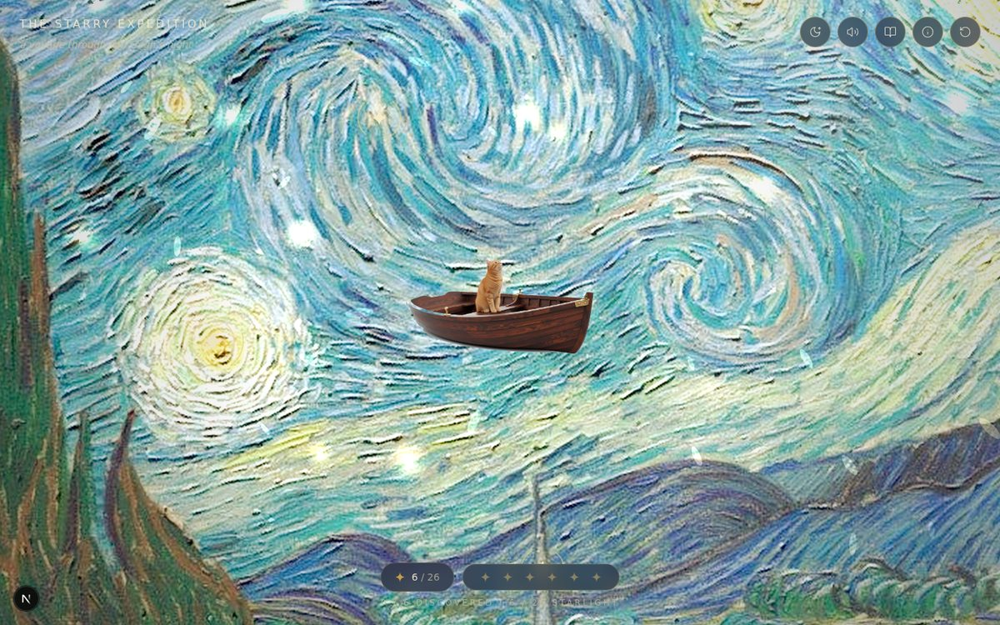
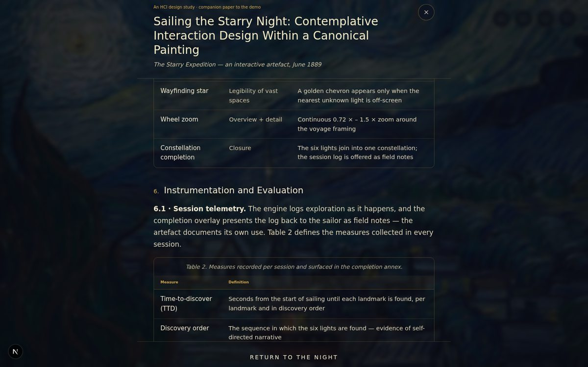
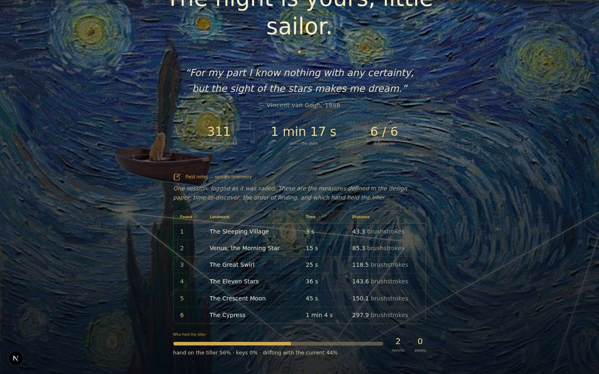

# The Starry Expedition

**A cat, a wooden boat, and Van Gogh's night.**

An interactive HCI design study: sail a wooden boat crewed by a real cat across the real canvas of Vincent van Gogh's *The Starry Night* (1889), to a live solo-piano arrangement of Pachelbel's *Canon in D* that begins the moment you arrive. Discover the painting's six landmarks, gather twenty-six motes of stray starlight, call a golden dawn over the same sky — and read the companion design paper, written into the demo itself.

> **Live demo:** `https://cathykernel.netlify.app`
> Deployed free on Netlify — drag-and-drop or Git-connected; see [DEPLOYMENT.md](DEPLOYMENT.md) for the full guide (Netlify, GitHub Pages, Vercel, Cloudflare Pages, and free custom domains).



---

## What it is

*The Starry Expedition* treats a painting as a navigable world. The unaltered canvas — cropped to the exact 92.1 × 73.7 cm proportion of the original and upscaled without retouching — becomes a 2088 × 1670 px sea and sky. A camera follows the boat with velocity look-ahead; a steering model (arrive behaviour after Reynolds, 1999) lets you steer with pointer, touch, or keyboard; and a flow field derived from the great swirl carries idle sailors with the celestial current.

The world is real, the sailor is real, and the music is real: the cat is a photographic orange tabby composited into a vintage wooden rowboat, and the *Canon in D* is not an audio file but a live Web Audio piano performance — a synthesized solo piano with felt-hammer transients, register-dependent decay, and a second canon voice two bars behind the first.

Six landmarks wait to be discovered by proximity — the crescent moon, Venus, the great swirl, the cypress, the sleeping village, and the eleven stars — each opening a museum card with curated art-history facts. Twenty-six stray motes of starlight drift across the sky, gathered by sailing near them. And the same canvas can be coaxed into dawn: a reversible golden re-lighting in which the stars retire and the piano lid opens a little.

## Screenshots

| | |
|:---:|:---:|
|  |  |
| The threshold — no scrolling, everything fits | Sailing the night under the swirl |
|  |  |
| Gathering a mote of stray starlight | The dawn — the same canvas, re-lit |
|  |  |
| The design paper, inside the demo | The constellation, complete |

## Interaction design

Every interaction answers a stated design goal, and the demo documents its own rationale:

- **The tiller** — the cursor is a tiller: the boat steers toward it relative to the camera. Keyboard overrides (WASD / arrows); on touch, drag to steer. Direct manipulation after Hutchins, Hollan & Norman (1985).
- **Proximity discovery** — no clicking on hotspots; sailing into a landmark's halo opens its museum card. Exploratory learning after Bruner (1961) and Falk & Dierking (2013).
- **The celestial current** — an idle timeout hands the helm to a flow field derived from the swirl, so doing nothing is still a gentle experience. Slow technology after Hallnäs & Redström (2001).
- **Gatherable starlight** — 26 motes with magnetic acquisition and chord-tone chimes; light behaves like a collectible resource. Malone (1981).
- **The two skies** — a reversible dawn: brightness, saturation, and a golden-hour overlay crossfaded over the same unaltered canvas in ~2.5 s, with the piano's "lid" opening. Calm technology after Weiser & Brown (1996).
- **A soundscape locked to the key** — every UI flourish (discovery chimes, starlight sparkle, the completion roll) is diatonic to the chord sounding at that instant.
- **Session telemetry as field notes** — discovery order, time-to-discovery, input-modality mix, revisits, zooms, and starlight gathered, surfaced honestly in the completion overlay.

## The design paper

Press the book button in the demo's HUD to read **"The Starry Expedition: Interaction Design for a Navigable Painting"** — a CHI-style companion paper written into the experience itself: abstract, three research questions, related work (14 real references), six design goals, a system description with figures and tables of techniques and measures, an instrumentation section with a proposed controlled protocol, and discussion. The demo doubles as its own artifact.

## Features

- Real *Starry Night* canvas as the world (unretouched, exact original proportion)
- Real photographic cat-and-boat sprite (AI-composited from photographs, VLM-verified)
- Live solo-piano *Canon in D* (Web Audio synthesis — no audio files, starts on arrival)
- 6 landmarks with proximity discovery, museum cards, and quotes
- 26 gatherable starlight motes with magnet, pop, and chord-tone chimes
- Reversible dawn / night toggle re-lighting the same canvas
- Constellation completion animation with session telemetry ("field notes")
- Full keyboard sailing, Escape handling, ARIA labels, `prefers-reduced-motion`
- Responsive from 4K desktop to mobile portrait and landscape

## Tech stack

- **Next.js 16** (App Router, fully static export — no server required)
- **React 19** + TypeScript
- **Canvas 2D** custom engine (frame-rate-independent timestep, camera, steering, flow field, particles)
- **Web Audio API** generative piano
- **Tailwind CSS 4** + **framer-motion** for the museum-grade UI
- **next/font/local** — Playfair Display & Cormorant Garamond, self-hosted

## Quickstart

Requires Node.js 20.9+.

```bash
npm install
npm run dev        # http://localhost:3000
```

Production static build (emits `out/`, deployable on any static host):

```bash
npm run build
npm run preview    # serve the exported site locally
```

To build for a sub-path (e.g. GitHub Pages project site):

```bash
NEXT_PUBLIC_BASE_PATH=/starry-expedition npm run build
```

## Deployment

Deploy free on **Netlify** — either drag the pre-built site onto [app.netlify.com/drop](https://app.netlify.com/drop) for a live URL in ten seconds, or connect the repository for automatic deploys on every push (a `netlify.toml` is included, so there is nothing to configure). A GitHub Pages workflow (`.github/workflows/deploy.yml`) ships as an alternative, alongside guides for Vercel, Cloudflare Pages, and free custom domains in **[DEPLOYMENT.md](DEPLOYMENT.md)**.

## Project structure

```
starry-expedition/
├── .github/workflows/deploy.yml   # auto-deploy to GitHub Pages
├── DEPLOYMENT.md                  # hosting & free-domain guide
├── docs/screenshots/              # the screenshots above
├── public/
│   ├── starry-night.jpg           # the world (2088 × 1670, unretouched)
│   ├── cat-boat.png / -small.png  # the sailor (photographic sprite)
│   └── landmarks/                 # six museum-card detail crops
└── src/
    ├── app/                       # layout, page, fonts, global styles
    ├── components/voyage/
    │   ├── VoyageCanvas.tsx       # Canvas 2D engine (world, camera, steering,
    │   │                          #   particles, starlight, dawn, telemetry)
    │   ├── IntroScreen.tsx        # the threshold (no-scroll, viewport-fit)
    │   ├── HUD.tsx                # progress, starlight chip, dawn & sound
    │   ├── DiscoveryCard.tsx      # museum cards
    │   ├── PaperModal.tsx         # the in-app CHI-style design paper
    │   ├── AboutModal.tsx         # design principles, with citations
    │   └── CompletionOverlay.tsx  # constellation + field notes
    └── lib/voyage/
        ├── audio.ts               # the live solo-piano Canon in D
        └── landmarks.ts           # world data: painting, landmarks, motes
```

## Assets & licensing

- **The Starry Night** — Vincent van Gogh, June 1889, oil on canvas. The painting entered the public domain decades ago; the reproduction here is a faithful photograph of a two-dimensional public-domain artwork, free of known restrictions.
- **Canon in D** — Johann Pachelbel, c. 1690. Public domain. The performance is synthesized live by the browser (Web Audio) — no recording is bundled, so no neighbouring rights apply.
- **The cat-and-boat sprite** — created by AI-assisted compositing of a real photographed orange tabby seated in a real vintage wooden rowboat.
- **Code** — MIT license. See [LICENSE](LICENSE). *(Replace the copyright line with your own name after forking.)*

## Acknowledgements

The Hague School of interaction design thinking, briefly: Van Gogh painted the night sky from memory in Saint-Rémy; Pachelbel wrote a canon that has outlived every library it was filed in; and a cat agreed to sit in a boat.

---

*Sail slowly. The sky rewards patience.*
